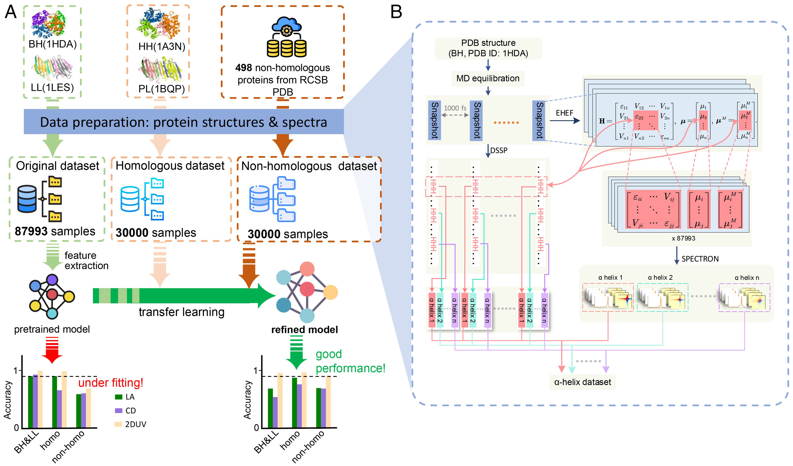

# ML-2DUV

This repository contains the the demo code for the secondary structure recognition  using 2DUV spectra, as described in the paper "Machine learning recognition of protein secondary structures based on two-dimensional spectroscopic descriptors" ([PNAS, 2022, DOI: 10.1073/pnas.2202713119](https://www.pnas.org/doi/full/10.1073/pnas.2202713119)). The whole data set were deposited on BaiDu Drive and Google Drive (see below), due to large size.

*created: 2022/04/28 @Zhang Qian*
*updated: 2022/05/01 @Hao Ren*



## Download dataset
We provide two kinds of datasets in different sizes.

We recommend downloading datasets of small size which just 1.4 GB: [BaiDu Drive](https://pan.baidu.com/s/1VYTjBFhtAza4Jybajdkhsw?pwd=PNAS)(extract code:PNAS) ,   [Google Drive](https://drive.google.com/file/d/1rcauC3Jwz3T-5WP-4cY9fEpp4huRxpKQ/view?usp=sharing). 

You can also download a full dataset in size of 30 GB: [DCAIKU](http://dcaiku.com:13000/).

All Spectral data was simulated using method from our another repository ([2duv_tutorial](https://github.com/MTSD-UPC/2duv_tutorial)).
## Data structure

Take 1.4G dataset as an example:

- original
  - original_dataset.npz
    - twoduv
    - la
    - cd
    - labels
  - original_transfer_dataset.npz
    - ...
 - homologous
   - homologous_dataset.npz
     - ...
   - homologous_transfer_dataset.npz
     - ...
 - nonhomologous
   - nonhomologous_dataset.npz
     - ...
   - nonhomologous_transfer_dataset.npz
     - ...


## Prerequisite
```
Python 3.X
Tensorflow>=2.4.0
keras-tuner>=1.0.2
scikit-learn>=0.22
scikit-image>=0.16
numpy
pandas
```
## Download code
```shell
git clone https://github.com/MTSD-UPC/ML-2DUV.git
cd ML-2DUV
```

